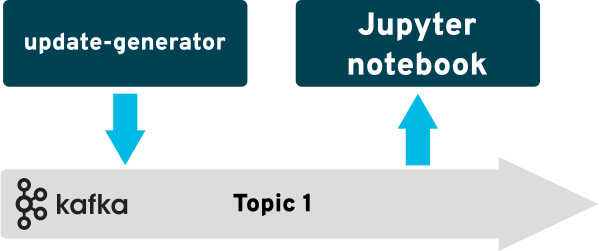
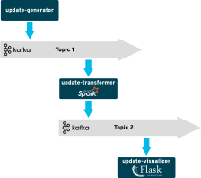

# radanalytics.io streaming and event processing lab

This repository contains artifacts and resources to support the streaming and
event processing labs for radanalytics.io.  [Our slides from the workshop at Big Data Spain 2018 are here](./BDS-adding-intelligence-to-stream-processing.pdf).

## Description

For many applications, it’s not enough to be able to process big data at
rest—you also need to be able to process streams of data in motion.

In this lab, you’ll learn how to use open source tools and frameworks from
radanalytics.io to develop and deploy intelligent event-processing
applications on Red Hat OpenShift. We’ll start by explaining some of the
concepts behind stream processing. Next, we’ll show you how to develop a
basic log-processing application and refine it by adding summarization,
queries, and features that take advantage of artificial intelligence and
machine learning.

## Prerequisites

* An OpenShift cluster available. For instructions on installing OpenShift
  (including ad-hoc single node test clusters), please see the
  [OpenShift Getting Started](https://docs.openshift.org/latest/getting_started/administrators.html#getting-started-administrators)
  documentation.

* An Apache Kafka broker available. For a basic Apache Kafka installation on
  OpenShift, we recommend these
  [instruction from Strimzi](http://strimzi.io/docs/0.1.0/#kafka-in-memory)
  as a starting point. Be sure to record the broker addresses for future use.

* A terminal with the OpenShift client `oc` available with an active login
  session.

* An OpenShift project with the
  [`resources.yaml`](https://raw.githubusercontent.com/radanalyticsio/streaming-lab/master/resources.yaml)
  manifest from this repository installed. To install this file, enter the
  following command, replacing the `<project name>` with your project:
   ```
   oc create -n <project name> -f https://raw.githubusercontent.com/radanalyticsio/streaming-lab/master/resources.yaml
   ```

### Synthetic social media update service

As the core of this lab is about processing and analyzing social media
updates, there is a service application that will produce these updates. The
`update-generator` directory contains the source and related files for
deploying this service.

To deploy the generator run the following command using the `oc` command line
tool. You must replace `<kafka-hostname:port>` with the values you recorded
earlier for the Kafka brokers.

```
oc new-app centos/python-36-centos7~https://github.com/radanalyticsio/streaming-lab/ \
  --context-dir=update-generator \
  -e KAFKA_BROKERS=<kafka-hostname:port> \
  -e KAFKA_TOPIC=social-firehose \
  --name=emitter
```

## Jupyter

[Jupyter](https://jupyter.org/) is an open source project born out of the
[IPython Project](https://ipython.org/) which delivers an in-browser
experience for interactive data science and scientific computing with support
for several programming languages. In this lab we will utilize Python, Apache
Spark, and a few natural language processing libraries.

The first portion of this lab is conducted through the lessons available in
the Jupyter notebooks contained in this repository.

This diagram shows an overview of the architecture for this portion of the
lab:



### Launching a notebook

WIP

## Analytics services on OpenShift

The second portion of this lab focuses on building and deploying an analytics
service based on the techniques learned in the notebooks.

There are two services which will be deployed, the `update-transformer`, and
the `update-visualizer`. The transformer will utilize Apache Spark to process
the synthetic social media updates and apply sentiment scores to each update.
The visualizer gives the user an interface to examine some of the work that
is being done by the transformer, it does this by displaying updates along with
the sentiment scores they have received.

This diagram shows an overview of the architecture for these services:



### Procedure

1. Deploy the update-transformer application. You will need the Kafka broker
   information for this command. To build and deploy the transformer use the
   following command:
    ```
    oc new-app --template=oshinko-python-spark-build-dc \
      -p APPLICATION_NAME=transformer \
      -p GIT_URI=https://github.com/radanalyticsio/streaming-lab \
      -p CONTEXT_DIR=update-transformer \
      -e KAFKA_BROKERS=<kafka-hostname:port> \
      -e KAFKA_IN_TOPIC=social-firehose \
      -e KAFKA_OUT_TOPIC=sentiments 
    ```
1. Deploy the update-visualizer application. You will again need the Kafka
   broker information for this command. To build and deploy the visualizer
   use the following command:
    ```
    oc new-app centos/python-36-centos7~https://github.com/radanalyticsio/streaming-lab \
      --context-dir=update-visualizer \
      -e KAFKA_BROKERS=<kafka-hostname:port> \
      -e KAFKA_TOPIC=sentiments \
      --name=visualizer
    ```
1. Expose a route to the visualizer. This command will expose an external URL
   to the visualizer which you will use to communicate with the application.
    ```
    oc expose svc/visualizer
    ```
1. Request the latest data from the visualizer. The `curl` utility provides a
   convenient method for accessing the current data in the visualizer. The
   following command will get that data:
    ```
    curl http://`oc get routes/visualizer --template='{{.spec.host}}'`
    ```

## Advanced details

The following sections provide an in-depth look at individual components of
this lab. They are here to help you build a deeper understanding of how the
pieces of this lab fit together.

### Source data

The source data for this lab is imagined as a series of synthetic social media
updates. The text from these updates will be used in conjunction with sentiment
analysis to help demonstrate the use of machine learning to investigate data.
The data used for this lab is randomly generated using
[Markov chains](https://en.wikipedia.org/wiki/Markov_chain). None of this data
is from live accounts and it contains no personally identifiable information.

The format used for transmitting the update data on the wire is defined by
this [JSON Schema](http://json-schema.org) notation:

```
{
    "title": "Social Media Update",
    "type": "object",
    "properties": {
        "user_id": {
            "type": "string"
        },
        "update_id": {
            "type": "string"
        },
        "text": {
            "type": "string"
        }
    },
    "required": ["user_id", "update_id", "text"]
}
```

