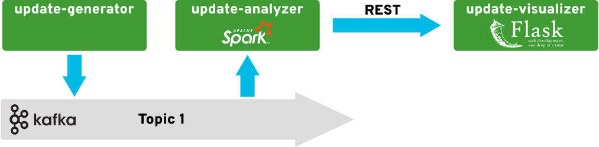

# radanalytics.io streaming and event processing lab

This repository contains artifacts and resources to support the streaming and
event processing labs for radanalytics.io.

## Description

For many applications, it’s not enough to be able to process big data at
rest—you also need to be able to process streams of data in motion.

In this lab, you’ll learn how to use open source tools and frameworks from
radanalytics.io to develop and deploy intelligent event-processing
applications on Red Hat OpenShift. We’ll start by explaining some of the
concepts behind stream processing. Next, we’ll show you how to develop a
basic log-processing application and refine it by adding summarization,
queries, and features that take advantage of artificial intelligence and
machine learning.

## Prerequisites

This lab requires access to an OpenShift cluster for deployment and operation
of applications, and an Apache Kafka broker for transmitting messages.

For instructions on installing OpenShift, please see the
[OpenShift Getting Started](https://docs.openshift.org/latest/getting_started/administrators.html#getting-started-administrators)
documentation.

For a basic Apache Kafka installation on OpenShift, we recommend these
[instruction from Strimzi](http://strimzi.io/docs/0.1.0/#kafka-in-memory) as a
starting point.

## Advanced details

The following sections provide an in-depth look at individual components of
this lab. They are here to help you build a deeper understanding of how the
pieces of this lab fit together.

### Source data

The source data for this lab is imagined as a series of synthetic social media
updates. The text from these updates will be used in conjunction with sentiment
analysis to help demonstrate the use of machine learning to investigate data.
The data used for this lab is randomly generated using
[Markov chains](https://en.wikipedia.org/wiki/Markov_chain). None of this data
is from live accounts and it contains no personally identifiable information.

The format used for transmitting the update data on the wire is defined by
this [JSON Schema](http://json-schema.org) notation:

```
{
    "title": "Social Media Update",
    "type": "object",
    "properties": {
        "user_id": {
            "type": "string"
        },
        "update_id": {
            "type": "string"
        },
        "text": {
            "type": "string"
        }
    },
    "required": ["user_id", "update_id", "text"]
}
```

### Stream analyzer service

The stream analyzer service, `update-analyzer`, is a Python application
which uses Apaceh Spark to process the stream data as it arrives. After each
update is processed by the analyzer, it is sent to a visualizer,
`update-visualizer` application by a HTTP based request. In this manner, the
data processing that is occurring in the analyzer can be viewed by a user.

The following diagram represents the architecture of this application
pipeline:



