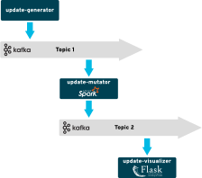

# radanalytics.io streaming and event processing lab

This repository contains artifacts and resources to support the streaming and
event processing labs for radanalytics.io.

## Description

For many applications, it’s not enough to be able to process big data at
rest—you also need to be able to process streams of data in motion.

In this lab, you’ll learn how to use open source tools and frameworks from
radanalytics.io to develop and deploy intelligent event-processing
applications on Red Hat OpenShift. We’ll start by explaining some of the
concepts behind stream processing. Next, we’ll show you how to develop a
basic log-processing application and refine it by adding summarization,
queries, and features that take advantage of artificial intelligence and
machine learning.

## Prerequisites

This lab requires access to an OpenShift cluster for deployment and operation
of applications, and an Apache Kafka broker for transmitting messages.

For instructions on installing OpenShift, please see the
[OpenShift Getting Started](https://docs.openshift.org/latest/getting_started/administrators.html#getting-started-administrators)
documentation.

For a basic Apache Kafka installation on OpenShift, we recommend these
[instruction from Strimzi](http://strimzi.io/docs/0.1.0/#kafka-in-memory) as a
starting point.

### Synthetic social media update service

As the core of this lab is about processing and analyzing social media
updates, there is a service application that will produce these updates. The
`update-generator` directory contains the source and related files for
deploying this service.

Before beginning this deployment you should already have a Kafka instance
running. Please record the hostname and port for the broker as you will need
it in this command. To deploy the generator simply run the following command
using the `oc` OpenShift tool:

```
oc new-app centos/python-36-centos7~https://github.com/radanalyticsio/streaming-lab/ \
  --context-dir=update-generator \
  -e KAFKA_BROKERS=<INSERT YOUR BROKER HOSTNAME:PORT HERE> \
  -e KAFKA_TOPIC=social-firehose \
  --name=emitter
```

## Jupyter

[Jupyter](https://jupyter.org/) is an open source project born out of the
[IPython Project](https://ipython.org/) which delivers an in-browser
experience for interactive data science and scientific computing with support
for several programming languages. In this lab we will utilize Python, Apache
Spark, and a few natural language processing libraries.

The first portion of this lab is conducted through the lessons available in
the Jupyter notebooks contained in this repository.

This diagram shows an overview of the architecture for this portion of the
lab:


### Launching a notebook

WIP

## Analytics services on OpenShift

The second portion of this lab focuses on building and deploying an analytics
service based on the techniques learned in the notebooks.

There are two services which will be deployed, the `update-analyzer`, and
the `update-visualizer`. The analyzer will utilize Apache Spark to process
the synthetic social media updates and apply sentiment scores to each update.
The visualizer gives the user an interface to examine some of the work that
is being done by the analyzer, it does this by display updates along with
the sentiment scores they have received.

This diagram shows an overview of the architecture for these services:



Starting the analytics services on OpenShift for this lab requires three
steps:

1. Deploy an Apache Spark cluster
2. Launch the analyzer service
3. Launch the visualizer service

### Deploy an Apache Spark cluster

To begin this portion of the lab, you will need to deploy an Apache Spark
cluster using the Oshinko webui tool.

**Step 1. Start the Oshinko webui service**

Begin by clicking the "Add to Project" drop down menu in the upper right of
the OpenShift console and selecting the "Select from Project" option.


Next, locate the "oshinko-webui" option in the service catalog, select it,
and then click "Next".


On the "Information" dialog, simply click "Next".


The "Configuration" dialog presents you with a form to change the default options for
the Oshinko webui. For this lab you will not be changing the options, click
on "Create" to begin the deployment.


On the "Results" dialog, simply click "Close" and you will return to the project
overview.


**Step 2. Deploy an Apache Spark cluster through the Oshinko webui**

From the overview page, click on the URL for the Oshinko webui.


You should now see the web page for the Oshinko webui, click on the "Deploy"
button.


Next you will see the "Deploy cluster" dialog. You will need to specify a
name for your cluster (no spaces) in the "Name" entry form. Once that is
done, click on the "Create" button.


The "Deploy cluster" dialog will disappear and you will now be looking at
the Oshinko webui "Clusters" page. From here you can monitor the deployment
and health of your cluster.


### Launching the analyzer service

The following screenshots provide a detailed illustration of deploying the
update analyzer. During this process you will build and deploy
analyzer on OpenShift, and an Apache Spark cluster will be automatically
deployed and bound to the analyzer.

**Step 1. Select the Apache Spark Python builder**

Begin by clicking the "Add to Project" drop down menu in the upper right of
the OpenShift console and selecting the "Select from Project" option.


Next, locate the "Apache Spark Python" option in the service catalog, select
it, and click "Next".


**Step 2. Fill in the details for the Apache Spark Python build**

On the "information" dialog window, simply select the "Next" option.


On the "Configuration" dialog window you will need to fill in several forms
before creating the service. Enter a name for your analyzer service in the
"Application Name" form. Then add the URL for the source code repository in
the "Git Repository" form, for the analyzer the repository URL is
`https://github.com/radanalyticsio/streaming-lab`. Next fill in the
"CONTEXT_DIR" field with the value `update-analyzer`. **Do not** click
"Create" yet.


Scroll down through the "Configuration" dialog until you find the "APP_ARGS".
The value for the "APP_ARGS" will be in the following form:
`--brokers=kafka.kafka.svc:9092 --topic=social-firehose --visualizer-host=visualizer --visualizer-port=8080`,
the instructor for your lab will have updated information for these values.
Next add the following value to the "SPARK_OPTIONS" field:
`--packages org.apache.spark:spark-streaming-kafka-0-8_2.11:2.1.0`. Lastly,
enter the name you chose for your Apache Spark cluster into the
"OSHINKO_CLUSTER_NAME" field. With the configuration completed, you are now
ready to click "Create".


Your analyzer service should now begin building, click on "Close" to clear
the dialog and return to the overview.


### Launching the visualizer service

The following screenshots provide a detailed illustration of deploying the
update visualizer. During this process you will build and deploy the
visualizer on OpenShift.

**Step 1. Select the Python builder**

Begin by clicking the "Add to Project" drop down menu in the upper right of
the OpenShift console and selecting the "Browse Catalog" option.


Next, locate the "Python" option in the service catalog, select it, and
click "Next".


**Step 2. Fill in the details for the Python build**

On the "Information" dialog window, simply select the "Next" option.


On the "Configuration" dialog window, you will need to select the project for your
deployment with the "Add to Project" dropdown. Then enter a name for your
application in the "Application Name" form. Finally you will enter the
URL for the source code repository in the "Git Repository" form, for the
visualizer the repository URL is
`https://github.com/radanalyticsio/streaming-lab`. With these options filled,
you will need to select the "advanced options" link to add a final detail.


In the advanced options page, locate the form entry named "Context Dir" and
add the value `update-visualizer`.


**Step 3. Start the build and deploy process**

With all the details filled in, simply select the "Create" button to begin
the process.


Upon creation you will be presented with a final status page, simply select
the "Continue to project overview." link to monitor the progress of your
application deployment.


## Advanced details

The following sections provide an in-depth look at individual components of
this lab. They are here to help you build a deeper understanding of how the
pieces of this lab fit together.

### Source data

The source data for this lab is imagined as a series of synthetic social media
updates. The text from these updates will be used in conjunction with sentiment
analysis to help demonstrate the use of machine learning to investigate data.
The data used for this lab is randomly generated using
[Markov chains](https://en.wikipedia.org/wiki/Markov_chain). None of this data
is from live accounts and it contains no personally identifiable information.

The format used for transmitting the update data on the wire is defined by
this [JSON Schema](http://json-schema.org) notation:

```
{
    "title": "Social Media Update",
    "type": "object",
    "properties": {
        "user_id": {
            "type": "string"
        },
        "update_id": {
            "type": "string"
        },
        "text": {
            "type": "string"
        }
    },
    "required": ["user_id", "update_id", "text"]
}
```

